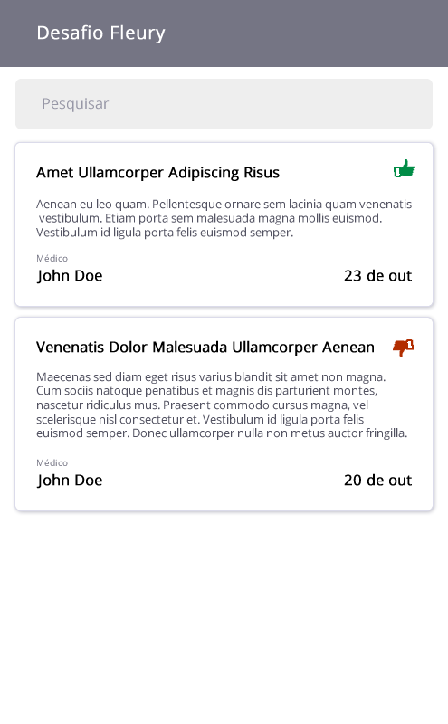

Desafio android
====

## Requisitos

- Kotlin
- ConstraintLayout
- Android 5.0+
- Faça um readme informando particularidades e justificativas para determinadas escolhas
- **Fonte:** OpenSans-Regular.ttf

## Sugestões

- Aplicar alguma arquitetura - MVVM, MVP, VIP, VIPER
- Framework para consumir os dados da API
- Procure enviar o relatório de cobertura de testes
- Feedback para o usuário e fluidez na navegação ganham pontos
- Teste instrumentado -> Espresso
- Teste unitário -> Qualquer framework, mas explique no readme as vantagens.
- Busca e filtragem dos dados na página inicial através do campo `name`

## Mockup

### Inicial



### Detalhes


## API

Estamos utilizando uma abstração do que temos internamente, usando o [mockAPI](www.mockapi.io).

- As datas estão em milisegundos (UTC), devem ser formatadas para o TimeZone do local do celular e exibidas conforme o mockup
- O atributo `healthy` determina se é positiva ou negativa a situação, está no formato `Boolean`

### Inicial
Retorna a lista de resultados de exames disponíveis para o usuário.

**URL:**
`GET - http://5bfbefa5cf9d29001345c529.mockapi.io/api/v1/results/`

**Retorno Esperado:**
```json
[
    {
        "id": 1,
        "name": "Hemograma, Sangue Total",
        "doctor": "Jack Shepard",
        "timestamp": 1538835201000,
        "healthy": true
    },
    {
        "id": 2,
        "name": "Proteína C Reativa, Soro",
        "doctor": "Kate Austen",
        "timestamp": 1538662401000,
        "healthy": false
    }
]
````

### Detalhes
A partir de um ID, retorna mais detalhes de determinado exame.

**URL:**
 `GET - http://5be19df804cb600013a61f1a.mockapi.io/api/v1/results/{id}`

**Resultado Esperado:**
```json
    {
        "id": 1,
        "name": "Hemograma, Sangue Total",
        "doctor": "Jack Shepard",
        "healthy": true,
        "timestamp": 1538835201000,
        "photo": "http://2.bp.blogspot.com/_LQNIuwCx4hk/SmnzNRYto5I/AAAAAAAABWs/tU_pjGNcbEI/s320/hurley.jpg",
        "unit": "g/dL",
        "refMin": 2,
        "refMax": 7,
        "items": [
            {
                "key": "Eritrócitos",
                "value": 3.65
            },
            {
                "key": "Hemoglobina",
                "value": 4.23
            },
            {
                "key": "Hematócrito",
                "value": 6
            }
        ]
    }
````

**O que precisa ser feito nessa tela:**
 1. Mostrar os `items` em um card conforme layout
 2. Criar o gráfico do "Valor de Referência": Barras verticais cujo valor mínimo e máximo são respectivamente `refMin` e `refMax`. O valor de referência é calculado partir da média dos `items` e a cor é determinada através do booleano `healthy`. As barras verticais devem ser preenchidas **integralmente**, podendo arrendondar o número para isso. **Por exemplo:** Se o `refMin = 0`e `refMax = 10`e o resultado da média é `4,5`, pode-se preencher apenas as 4 primeiras barras.
 
 Nos detalhes do `id = 2` retiramos propositalmente os dados dentro do *array* `items`. Portanto, ao invés de mostrar o card do gráfico do "Valor de referência", pedimos que trate o erro de acordo com o que preferir.

## Como submeter?

Deverá ser enviado um PULL REQUEST com o seu teste.

### Como funciona?

- Fork deste repositório
- Clonar a partir do repositório que foi criada na sua conta
- Procure fazer o máximo de commits com todas as suas decisões
- Abra um Pull Request para este repositório

## Dúvidas

Consulte as *issues* para ver se outro Desenvolvedor já não a fez e caso você não ache sua resposta, abra você mesmo uma nova *issue.*
