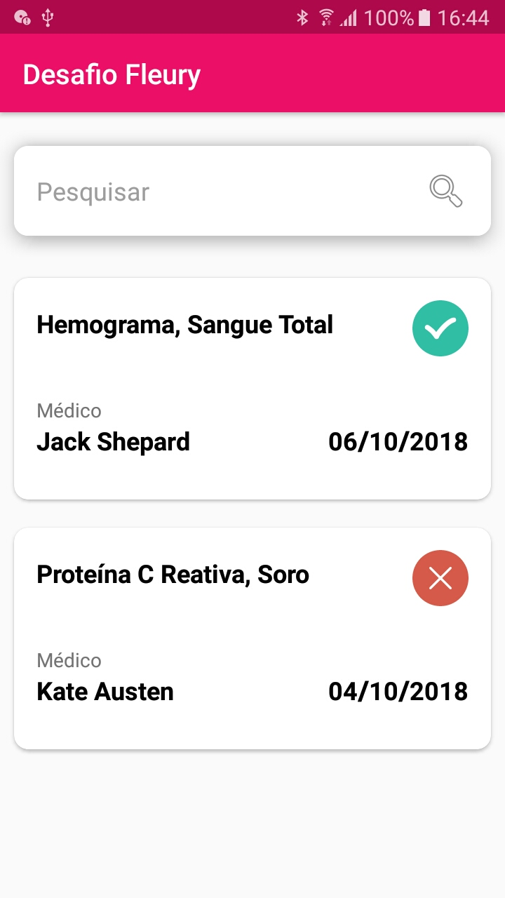

Desafio android
====

## Requisitos

- Kotlin
- ConstraintLayout
- Android 5.0+
- Faça um readme informando particularidades e justificativas para determinadas escolhas
- **Fonte:** OpenSans-Regular.ttf

## Sugestões

- Aplicar alguma arquitetura e justificar
- Framework para consumir os dados da API
- Feedback para o usuário e fluidez na navegação ganham pontos
- Teste unitário -> Qualquer framework, mas explique no readme as vantagens.

## Mockup

### Inicial



## API

Estamos utilizando uma abstração do que temos internamente, usando o [mockAPI](www.mockapi.io).

- As datas estão em milisegundos (UTC), devem ser formatadas para o TimeZone do local do celular e exibidas conforme o mockup
- O atributo `healthy` determina se é positiva ou negativa a situação, está no formato `Boolean`

### Inicial
Retorna a lista de resultados de exames disponíveis para o usuário.

**URL:**
`GET - http://5bfbefa5cf9d29001345c529.mockapi.io/api/v1/results/`

**Retorno Esperado:**
```json
[
    {
        "id": 1,
        "name": "Hemograma, Sangue Total",
        "doctor": "Jack Shepard",
        "timestamp": 1538835201000,
        "healthy": true
    },
    {
        "id": 2,
        "name": "Proteína C Reativa, Soro",
        "doctor": "Kate Austen",
        "timestamp": 1538662401000,
        "healthy": false
    }
]
````

**O que precisa ser feito nessa tela:**
 - Mostrar os `items` em um card conforme layout
 
## Como submeter?

Deverá ser enviado um PULL REQUEST com o seu teste.

### Como funciona?

- Fork deste repositório
- Clonar a partir do repositório que foi criada na sua conta
- Procure fazer o máximo de commits com todas as suas decisões
- Abra um Pull Request para este repositório

## Dúvidas

Consulte as *issues* para ver se outro Desenvolvedor já não a fez e caso você não ache sua resposta, abra você mesmo uma nova *issue.*
